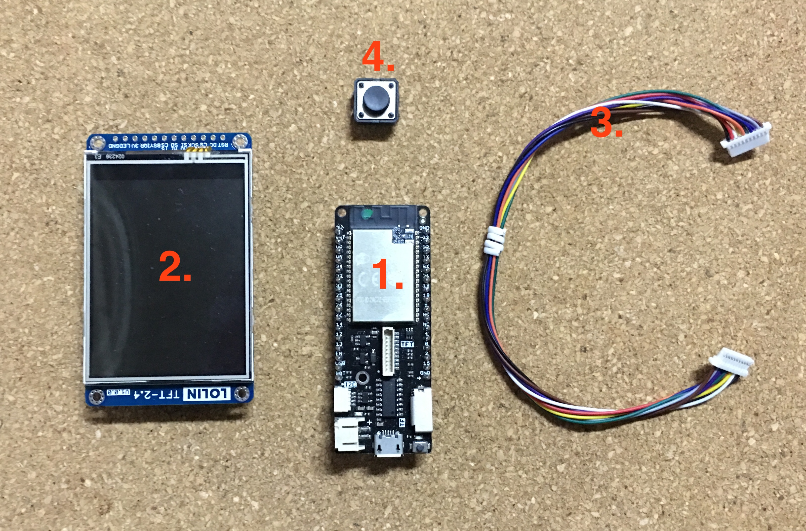
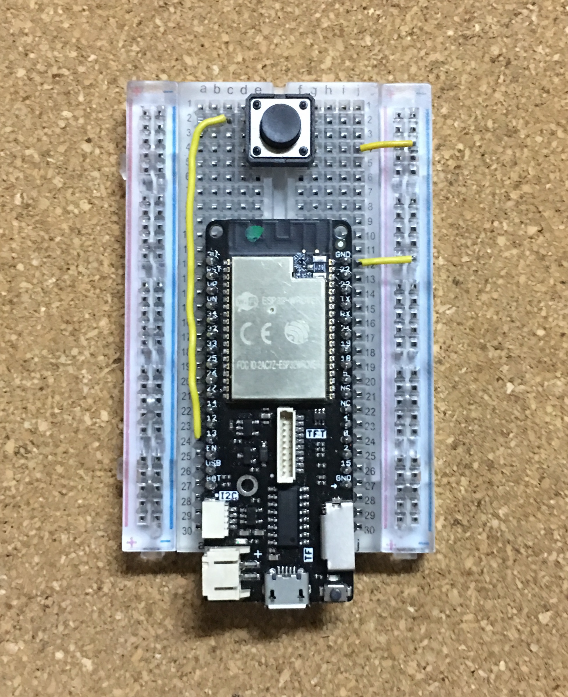
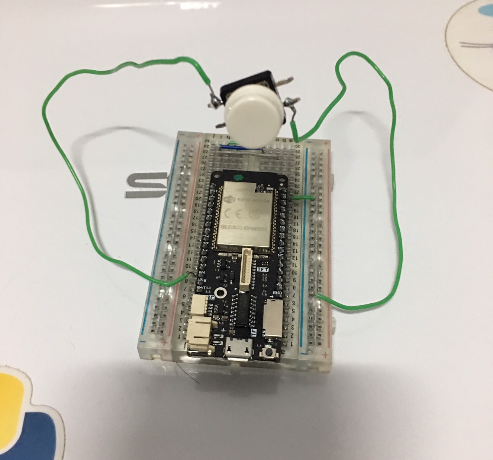
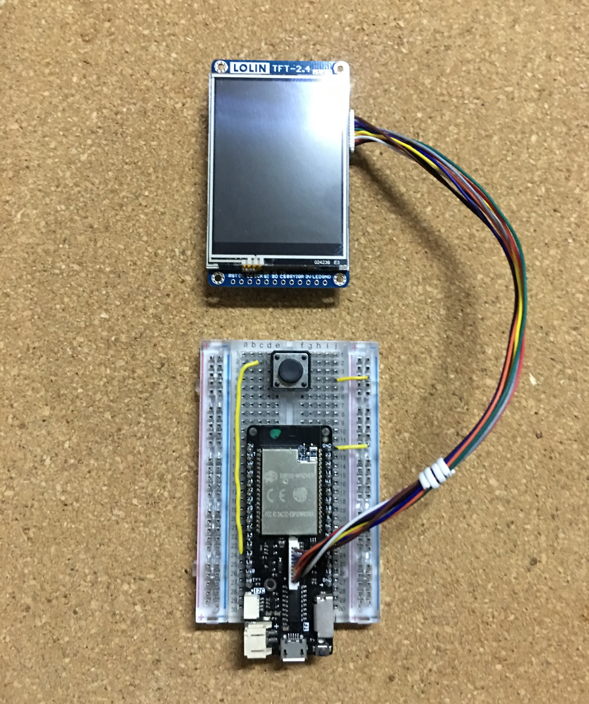
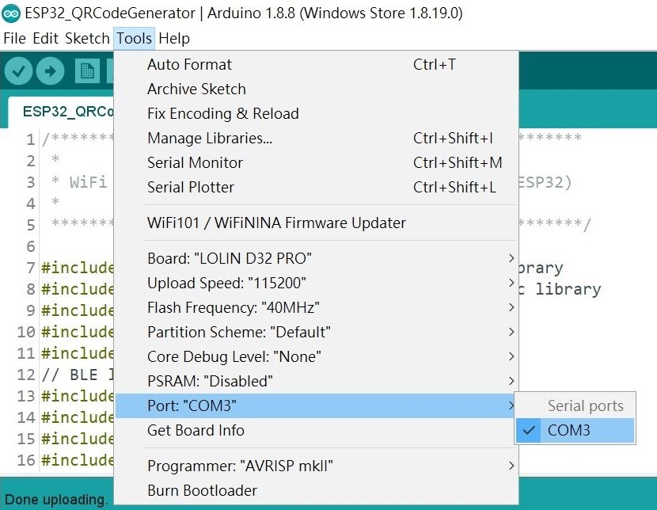
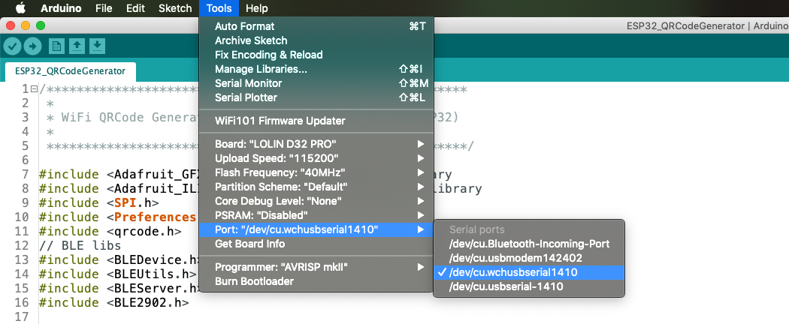
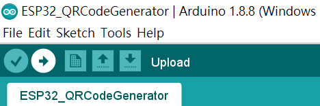

# 自製 WiFi QR Code 產生器裝置

## § 材料準備



1. [LOLIN D32 Pro](https://wiki.wemos.cc/products:d32:d32_pro)
2. [LOLIN TFT 2.4 Touch Shield](https://wiki.wemos.cc/products:d1_mini_shields:tft_2.4_shield)
3. TFT Cable
4. 按鈕

1、2、3 項可以在 [WEMOS.CC](https://www.wemos.cc/) 找到購買網址，第 4 項按鈕在一般的電子材料行即可買到。


## § 組裝

先將按鈕的其中一腳接到 LOLIN D32 Pro 的 13 號腳位，按鈕對角線一腳接到 GND，如下圖所示：



或是如下圖這樣也可以：




然後將 TFT 螢幕接上：




## § 設定 Arduino IDE 環境

1. 請先閱讀 [arduino-esp32](https://github.com/espressif/arduino-esp32) 的 README.md，照裡頭的步驟安裝好 ESP32 Board 套件。
2. 然後到 [WEMOS wiki](https://wiki.wemos.cc/downloads) 裡下載 Serial port Driver，並安裝之。
3. 把 D32 Pro 連接到電腦上，然後下載本 Repo 的 ESP32_QRCodeGenerator.ino，並用 Arduino IDE 開啟這個 ino 檔案。
4. 點選 Arduino IDE 選單 -> Sketch -> Include Library -> Manage Libraries...，然後安裝以下程式庫：

    - Adafruit GFX Library (by Adafruit)
    - Adafruit ILI9341 (by Adafruit)
    - XPT2046_Touchscreen (by Paul Stoffregen)
    - QRCode (by Richard Moore)

5. 如果之前有安裝過 BLEPeripheral (by Sandeep Mistry) 這個程式庫，請先刪除這個程式庫，因為裡頭一些 class name 跟 ESP32 BLE 程式庫裡的 class name 有衝突。
6. 點選 Arduino IDE 選單 -> Tools -> Board: -> 選擇 `LOLIN D32 PRO`； Upload Speed: -> 選擇 `115200`； Flash Frequency: -> 選擇 `40MHz`。
7. 點選 Arduino IDE 選單 -> Tools -> Port，選擇連接 D32 Pro 的 Serial port，Windows 上的名稱通常都是 COM`X`，Mac 上的名稱通常都是 /dev/cu.wchusbserial`XXXX` (X 為數字)。如下圖所示：

**Windows：**


**macOS：**



## § 修改 BLE DEVICE NAME

找到 ESP32_QRCodeGenerator.ino 程式碼中的這一行：

```cpp
#define MY_BLE_DEVICE_NAME  "RL_WIFIQR_Generator-1788"
```

把這個裝置名稱修改成自己想要的名字。我的習慣通常是用 **裝置前綴名** + **一組數字** 來組成名稱，以這裡為例，`RL_WIFIQR_Generator` 就是裝置前綴名，後面接一組數字 `-1788`，然後如果需要多台裝置，就改變後面那組數字即可。


## § 上傳程式到 D32 Pro

按下 Arduino IDE 的 Upload 按鈕，編譯程式並上傳程式到 D32 Pro：



## §

## §

## §

