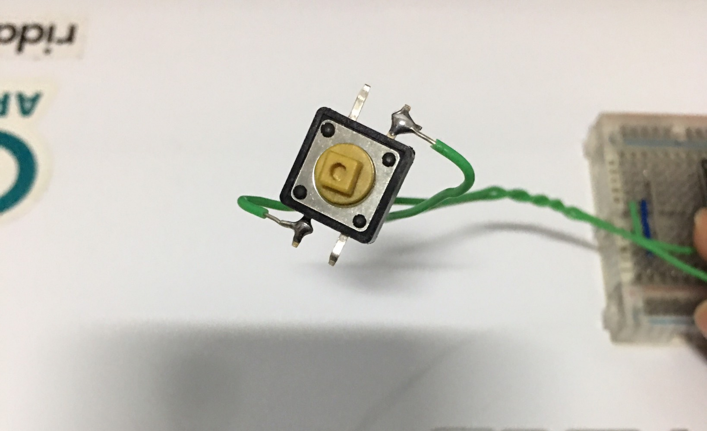

# 自製 WiFi QR Code 產生器裝置

## § 材料準備


1. [LOLIN D32 Pro](https://wiki.wemos.cc/products:d32:d32_pro)
2. [LOLIN TFT 2.4 Touch Shield](https://wiki.wemos.cc/products:d1_mini_shields:tft_2.4_shield)
3. TFT Cable
4. 按鈕

1、2、3 項可以在 [WEMOS.CC](https://www.wemos.cc/) 找到購買網址，第 4 項按鈕在一般的電子材料行即可買到。


## § 組裝

先將按鈕的其中一腳接到 LOLIN D32 Pro 的 13 號腳位，按鈕對角線一腳接到 GND，如下圖所示：


或是如下圖這樣也可以：




然後將 TFT 螢幕接上：


## § 設定 Arduino IDE 環境

1. 請先閱讀 [arduino-esp32](https://github.com/espressif/arduino-esp32) 的 README.md，照裡頭的步驟安裝好 ESP32 Board 套件。
2. 然後到 [WEMOS wiki](https://wiki.wemos.cc/downloads) 裡下載 Serial port Driver，並安裝之。
3. 把 D32 Pro 連接到電腦上，然後下載本 Repo 的 ESP32_QRCodeGenerator.ino，並用 Arduino IDE 開啟這個 ino 檔案。
4. 點選 Arduino IDE 選單 -> Sketch -> Include Library -> Manage Libraries...，然後安裝以下程式庫：

    - Adafruit GFX Library (by Adafruit)
    - Adafruit ILI9341 (by Adafruit)
    - XPT2046_Touchscreen (by Paul Stoffregen)
    - QRCode (by Richard Moore)

5. 如果之前有安裝過 BLEPeripheral (by Sandeep Mistry) 這個程式庫，請先刪除這個程式庫，因為裡頭一些 class name 跟 ESP32 BLE 程式庫裡的 class name 有衝突。
6. 點選 Arduino IDE 選單 -> Tools -> Board: -> 選擇 `LOLIN D32 PRO`； Upload Speed: -> 選擇 `115200`； Flash Frequency: -> 選擇 `40MHz`。
7. 點選 Arduino IDE 選單 -> Tools -> Port，選擇連接 D32 Pro 的 Serial port，Windows 上的名稱通常都是 COM`X`，Mac 上的名稱通常都是 /dev/cu.wchusbserial`XXXX` (X 為數字)。如下圖所示：

**Windows：**


**macOS：**


## § 修改 BLE DEVICE NAME

找到 ESP32_QRCodeGenerator.ino 程式碼裡的這一行：

```cpp
#define MY_BLE_DEVICE_NAME  "RL_WIFIQR_Generator-1788"
```

把這個裝置名稱修改成自己想要的名字。我的習慣通常是用 **裝置前綴名** + **一組數字** 來組成名稱，以這裡為例，`RL_WIFIQR_Generator` 就是裝置前綴名，後面接一組數字 `-1788`，然後如果需要多台裝置，就改變後面那組數字即可。


## § 編譯並上傳程式

按下 Arduino IDE 的 Upload 按鈕，編譯程式並上傳程式到 D32 Pro：


## § 開啟裝置的 BLE 名稱廣播

按下裝置上的按鈕，大約長按 3 ~ 4 秒，TFT 螢幕下方會出現一行小字：`Start BLE Advertising...`，表示此裝置已經開始廣播了，這時如果使用一些藍牙掃描軟體，就可以發現會出現上面設定的那個裝置名稱 (例如 `RL_WIFIQR_Generator-1788`)。

**長按按鈕 3 ~ 4 秒，直到出現 Start BLE Advertising...：**


## § 設定 WiFi QR Code

用 PC/Mac 或是 Android 上的 Chrome 網頁瀏覽器開啟此網址： [https://kyumdbot.github.io/app/bleWiFiQR/](https://kyumdbot.github.io/app/bleWiFiQR/)

按下網頁上的 `Scan Bluetooth Devices` 按紐，開始掃描 BLE 裝置：


找到裝置名稱，點選裝置，並按下配對。

接著選擇 Authentication Type，填入 SSID 跟 Password 後，按下 `SETUP` 按鈕，等出現 Setup done! 即完成設定。


> Web 版 Setup app 的原始碼在：[https://github.com/kyumdbot/kyumdbot.github.io/tree/master/app/bleWiFiQR](https://github.com/kyumdbot/kyumdbot.github.io/tree/master/app/bleWiFiQR)，如果你想自行撰寫 app 控制這個裝置，可參考此程式碼。

    
    

## § 停止裝置的 BLE 廣播

QR Code 設定完成後，請務必要停止裝置的 BLE 廣播，這樣才比較不會讓別人偷偷連到你的裝置。

要停止裝置的 BLE 廣播，首先按下 Setup 網頁上的 `Disconnect` 按鈕，中斷 Setup 網頁跟裝置的 BLE 連線，接下來長按按鈕 3 ~ 4 秒，裝置會 Restart (或是直接按下 D32 Pro 上的 reset 按鈕，或直接把電源拔掉重插，都有一樣的效果)。


> 備註：本來在開啟廣播後，再長按按鈕會切換成 Advertising Stop 狀態，但因為日前發現 BLEAdvertising->stop() 不起作用，所以我把程式的 pAdvertising->stop() 改成 ESP.restart()。


## § 用手機掃描 QR Code，快速加入 WiFi

Android 手機請先到 Play Store 搜尋並安裝 ZXing team 的條碼掃描器，然後用這個 app 掃描 QR Code，即可選擇是否要連接此 WiFi：


iPhone 在 iOS 11 以後，直接用內建的相機 app，即可掃描 QR Code：


## § 如何用 iPhone 設定這個裝置

因為目前 iOS 還不支援 Web Bluetooth，所以無法執行我寫的 Web Setup app，但是可以用像是 LightBlue Explorer 之類的 app 去讀寫 BLE 裝置，所以還是有辦法可以控制這個 BLE 裝置。

先安裝 [LightBlue Explorer](https://itunes.apple.com/tw/app/lightblue-explorer/id557428110?mt=8) 這個 app，然後執行這個 app。

在首頁裡可以看到附近 BLE 裝置的列表，選擇自己的 WiFi QR Code 裝置 (此例為：`RL_WIFIQR_Generator-1788`)，點選裝置後， LightBlue Explorer app 會連線到 BLE 裝置，接下來可以看到這個裝置提供了那些服務 (會列出服務的 UUID 跟 Characteristic 的 UUID)。

這裡列出 4 個 Characteristic UUID，分別是：

- Type     : **0x0000DD01**-0000-1000-8000-00805F9B34FB
- SSID     : **0x0000DD02**-0000-1000-8000-00805F9B34FB
- PASSWORD : **0x0000DD03**-0000-1000-8000-00805F9B34FB
- ACTION   : **0x0000DD05**-0000-1000-8000-00805F9B34FB

我們先點選 Type (0x0000DD01) 這個 Characteristic，修改 Type 的值。點選右上角的`Hex`：


然後選擇 Characteristic 的格式為 UTF-8 String。

接下來點選 `Write new value`，若你的 WiFi 是用 WPA/WPA2，請輸入`WPA`；若是用 WEP，請輸入`WEP`：


接下來依序設定 SSID (0x0000DD02)、PASSWORD (0x0000DD03)、ACTION (0x0000DD05) 的值，格式都是使用 UTF-8 String。

SSID (0x0000DD02)、PASSWORD (0x0000DD03) 的值就是輸入你的 SSID、Password，ACTION (0x0000DD05) 的值輸入`1`。

> 這裡要注意一點，ACTION (0x0000DD05) 的值要最後輸入，因為當裝置發現 ACTION (0x0000DD05) 的值變成非`0`的值，就會刷新 QR Code，所以要最後輸入。


ACTION (0x0000DD05) 的值輸入完後，應該可以發現裝置的 TFT 螢幕會閃動一下，這表示 QR Code 已經更新了，這時你可以用手機掃描 QR Code，測試看看是否正確。


## § 製作外殼

先找一個紙盒，並在紙盒上切開一個跟 TFT 螢幕大小相等的洞，然後將 TFT 螢幕放進洞裡，並貼上膠帶固定，如下圖所示：


然後將 D32 Pro 放進盒子裡，接上該接的線路，如下圖所示：


把盒子掛到牆上即**大功告成**：


